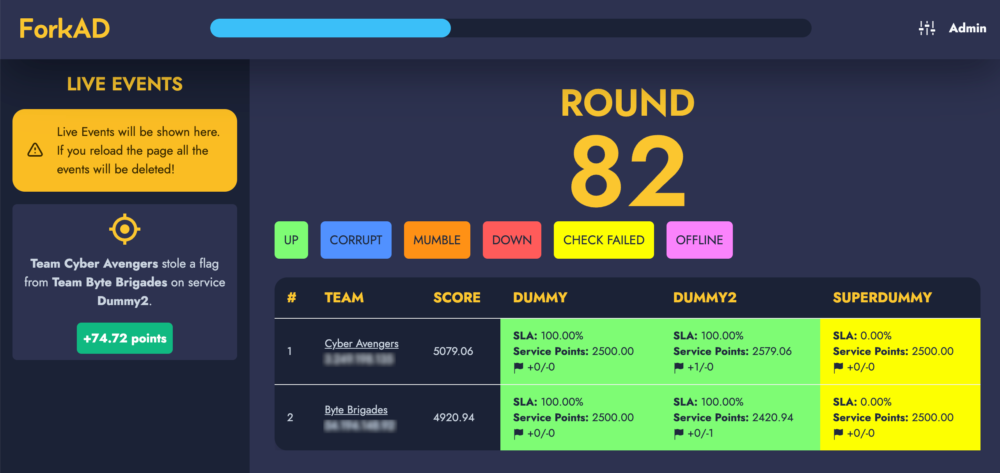

# ForkAD

  

**ForkAD** is a sleek UI for the [ForcAD](https://github.com/pomo-mondreganto/ForcAD) application, built with *React* and styled with *TailwindCSS*. 🚀

## Features 🌟

- Intuitive interface for managing ForcAD operations effortlessly. 🎯
- Enhanced user experience with smooth animations and responsive design. 💻

## Installation 🛠️

Follow these simple steps to get ForkAD up and running instead of the default UI:

1. Clone this repository **inside** the ForcAD folder
2. Build the ForkAD frontend (``cd ForkAD && yarn && yarn build``)
3. Overvwrite the default frontend (``cd .. && rm -rf front && mv ForkAD front``)
4. Rebuild the ForcAD containers

## Contribution 🤝

Contributions are always welcome! If you have any ideas for improvements or would like to report a bug, please feel free to open an issue or submit a pull request. 🌈

## Credits
ForkAD is proudly developed [@SecSI](https://secsi.io) by:
- [Angelo Delicato](https://github.com/thelicato)

## License 📄

This project is licensed under the MIT License - see the [LICENSE](LICENSE) file for details. 📝
